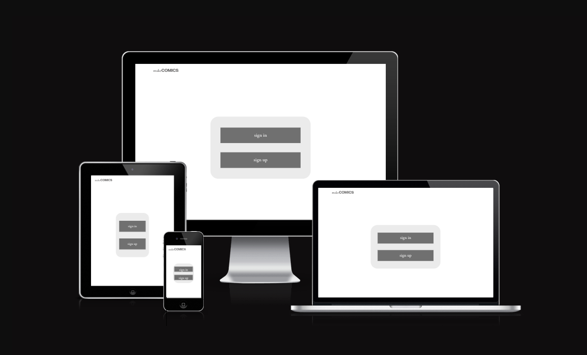

# **MakeCOMICS - a project management app for comic creators**

This project is the fifth milestone project for the Code Institute Diploma in Full Stack Software Development. 
You can see the final deployed site [here.](https://makecomics-api.herokuapp.com/)

The application is designed to help comic creative teams organise and provide feedback on comic projects. 

* [UX](#ux)
    * [User Stories](#user-stories)
    * [Wire Frames](#wire-frames)

* [Testing](#testing)
* [Technologies Used](#technologies-used)
    * [Languages](#languages)
    * [Packages and frameworks](#packages-and-frameworks)
    * [API](#api)
    * [Version Control](#version-control)
    * [Other Software](#other-software)
* [Deployment](#deployment)
* [Credits](#credits)
    * [Content](#content)
    * [Acknowledgements](#acknowledgements)

## UX
### User Stories
<!-- 
I used an agile methodology to devlop the app. The various features were broken up into the following user stories and grouped into epics where applicable.  -->

<!-- As I started working on each user story they were further broken down into tasks. I tracked the progress of the user stories using github projects. You can see the current state of the project [here](https://github.com/John-McPherson/Full-Stack-Tool-Kit-Portfolio-Project/projects/1). -->

#### **Users should be able to create an account so their settings can persist over multiple sessions.** 

* As a user I can create an account so that my content is maintained between sessions
* As a user I can log out and in so that my account is secure
* As a user I can delete my account so that if I am no longer using the service I don't have any information stored on the app
* As a user I can change my account details so that I know my data isn't being stored after I have finished using the app. 

#### **Users should be able to add collaborators so that only the creative team can see wip content**

* As a user I can add collaborators when creating content so that I can ensure that only team members can access the project. 

#### **Users can comment on projects they are collaborators on**

* As a user I can comment on projects that I am a collaborator so that I can provide feedback on pages as they are posted. 
* As a user I can read other collaborators comments so that I can act on feedback provided. 

#### **Users should be able to upload multiple versions of a page**

* As a user I can upload pages projects that I am a collaborator so that I can demonstrate my work. 
* As a user I can upload multiple versions of the same pages so that I can compare wip pages.

### Wire frames

I used Adobe UX to prototype the websites UX. I took a mobile first approach to the development.

Here is a [link](https://xd.adobe.com/view/788249f5-1298-460f-9fe1-937747227c7e-2dd1/) to the working prototype mobile version and to the desktop version [link](https://xd.adobe.com/view/4007359e-0f8c-466a-97cd-2a79d2a76a18-1554/).

## Testing

[Link to External testing document](./TESTING.md)

## Technologies Used

### Languages

* JSX - as the makeComics is a react application the main body of the site was written in JSX
* Less CSS - the styling was handled though Less CSS. These were then compiled using the Easy LESS extension into CSS modules.

### APIs
* makeComics API - data is stored and accessed through a custom api. 

### Packages and frameworks
* React - the site was built using the react framework.
* Bootstrap4 - the site relies on the bootstrap libariy to quickly write and style html. 
* Axios - was used to fetch and post data from and to the makeComics-api

### Version Control

* Github - All version control was handled through Github. 

### Other Software
* [Adobe XD](https://www.adobe.com/uk/products/xd.html) - was used to create the prototype wireframes and to help get the design of the site. 
* [coolors](https://coolors.co/) - the colour scheme for the site was generated using coolers.co

### Fonts 
* [Adobe fonts](https://fonts.adobe.com) - I used [Forma DJR Deck](https://fonts.adobe.com/fonts/forma-djr-deck) and [Garamond Premier](https://fonts.adobe.com/fonts/garamond-premier) font families from adobe fonts. They were licensed as part of my adobe creative cloud subscription. 
* [Font Awesome](https://fontawesome.com/) - all icons were taken from Fontawesome. 

## Deployment

The app is deplpoyed via [Heroku](https://www.heroku.com/). If you have cloned the repo follow the steps below to deploy your own version. 

1. Go to the [Heroku website](https://heroku.com/) and log in to your account. If you have not made one yet first create an account.

2. On the home page click the new button and then click create new app. 

3. On the next page enter a name for the app. This has to be unnique. You cannot use the same name as I have. Then enter your location before clicking create app. 

4. if you haven't already link your github account to your heroku account

5. Click on the Deploy tab on Heroku and scroll down to the deployment method and Select Github. 

6. Scrol down to the app connected to Github section and locatate your cloned directory and connect it to the cloned directory. 

7. Select main branch in the manual deployment section and click deploy branch. 

## **Credits**

### **Content**

The majority of code that is not included as part of a framework or libary was was written by me with the following exceptions;

* The currentUserContext.js file was taken from the [code insitute moments project](https://github.com/Code-Institute-Solutions/moments). 
* The code for the useClickOutsideToggle was taken from the [code insitute moments project](https://github.com/Code-Institute-Solutions/moments). 
* The code to display comments was adapted from the [code insitute moments project](https://github.com/Code-Institute-Solutions/moments). 

### **Acknowledgements** 

* My mentor [Mbakwe Caleb](https://github.com/caleboau2012) for their feedback and support during the development of the project. 
* [Code Institute](https://codeinstitute.net/) for giving me the skills through their tutorials to create this app. 

